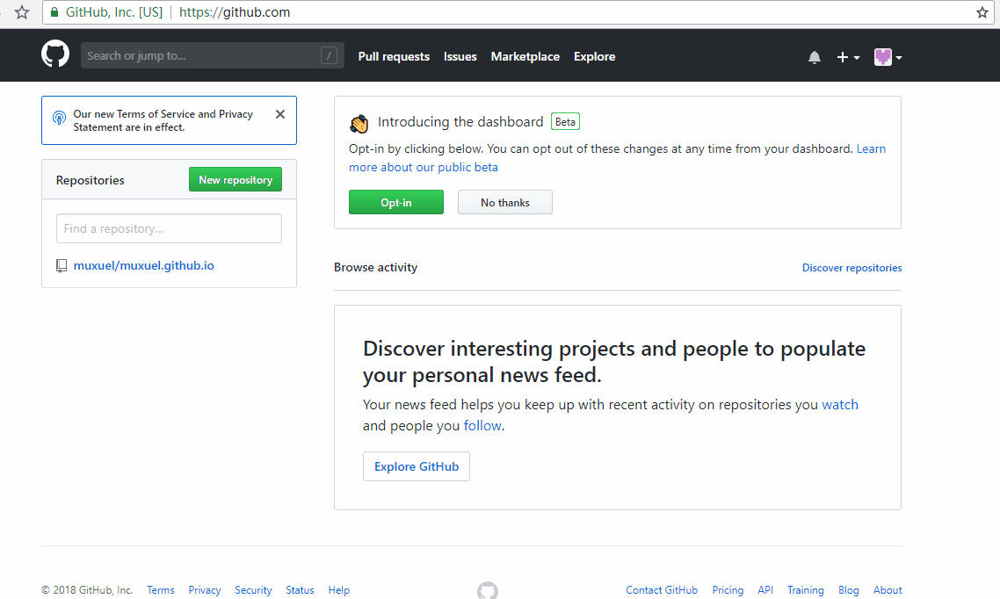

# Hexo建站

***可以先通篇看完，有不同方案***

## 关于网站文件

我传给你的`muxuel`文件夹是网站的所有文件，所有关于创建文章、更新网站信息的内容都在此文件中可以找到。

## 关于网站的配置文件信息

可以查看目录为`muxuel/_config.yml`配置文件，配置详情可以查看[hexo官方配置详解](https://hexo.io/zh-cn/docs/configuration)来修改作者、网站标题等信息。

## 关于网站远程GitHub与本机连接

由于此网站使用的静态网页技术，通过前端将`Markdown`文件渲染成的静态网页文件发送到远程GitHub库中完成静态网页的展示与托管，所有，需要将本机与远程GitHub连接，保证以后更新网站后，能够直接发送到远程服务器上。其步骤很简单：

1. 右击桌面找到`Git Bash here`选项（确认已安装git for windows）并打开git bash页面

2. 输入以下指令加载用户名

   ```bash
   git config --global user.name "muxuel"
   ```

3. 输入以下指令加载用户邮箱

   ```bash
   git config --global user.email "muxuel@126.com"
   ```

4. 输入以下指令获取ssh连接码

   ```bash
   ssh-keygen -t rsa -C "muxuel@126.com"
   ```

   **如果嫌麻烦，可以直接双击运行博客下面的`绑定GitHub.bat`文件，完成以上几步操作**

5. 执行完上一条指令后，窗口会暂停，此时一路按`Enter`键，直到结束

6. 使用文本编辑器打开`C:\Users\[你的计算机用户名]\.ssh\id_rsa.pub`文件，复制所有文本

7. 打开[GitHub官网](https://github.com/)，已经使用邮箱`muxuel@126.com`完成注册，其用户名与密码与邮箱相同，登陆即可

8. 打开GitHub的设置页面，将第6步复制的文本信息粘贴到一个新的SSH中并输入密码即可！详情查看动图。*PDF没有动图，直接打开git即可，或者使用markdown预览工具在文章内查看*

   

到此，可以上传文件了

## 如何创建新文章并发布

在与网站项目的配置文件(_config.yml)同级的目录下，打开终端（cmd或者git bash）输入`hexo new post "XXX"`,`XXX`即为新文章的文件名，即可创建新文章。

创建新文章后，可以打开`muxuel\source\_posts`目录，可以查看到创建的文件，使用文本编辑器打开即可编写markdown文件并上传到GitHub。

发布文章可以使用指令：

```bash
hexo clean&&hexo g&&hexo d
```

或者直接双击运行我写的`hexo-上传.bat`脚本，自动上传。`第一次`运行脚本时需要输入GitHub的账号和密码登录验证一次。

脚本`hexo-预览.bat`可以不发布文章，直接在本地浏览器打开，预览文章。

## 说明

其实整个过程很简单，平时写文章只需要创建新文章一条指令就行了，其他指令只是为了搭建项目，只会使用一次。

markdown语法很简单，10分钟内可以学会写文章。推荐使用[Typora](https://www.typora.io/#windows)来编辑文章！

另外，此博客插入图片时尽量使用图床或第三方图片。

enjoy it！